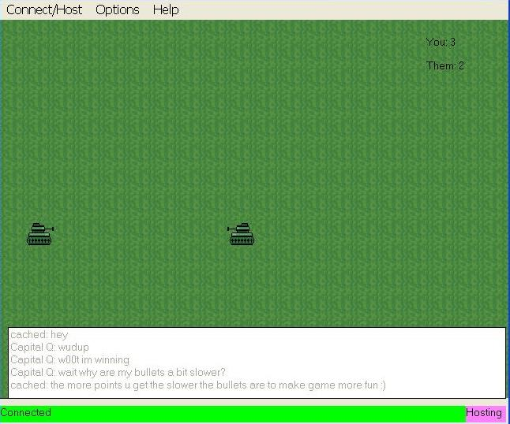



## Multiplayer Tank game

### Description

Its a 2 player game in which both parties can move around and attempt to shoot the other person. Its pretty fun, so try it out. Also, the source is currently pretty ugly but going to be prettier soon. Special thanks to Mephisto for helping me out with his tutorial (cant find it again... sorry!)
 
### More Info
 
u can also play yourself :)

             |
---                |---
**Submitted On**   |2004-06-23 19:30:56
**By**             |[QWERTY UIOP](https://github.com/Planet-Source-Code/PSCIndex/blob/master/ByAuthor/qwerty-uiop.md)
**Level**          |Intermediate
**User Rating**    |4.8 (43 globes from 9 users)
**Compatibility**  |VB 6\.0
**Category**       |[Games](https://github.com/Planet-Source-Code/PSCIndex/blob/master/ByCategory/games__1-38.md)
**World**          |[Visual Basic](https://github.com/Planet-Source-Code/PSCIndex/blob/master/ByWorld/visual-basic.md)
**Archive File**   |[Multiplaye1761246232004\.zip](https://github.com/Planet-Source-Code/qwerty-uiop-multiplayer-tank-game__1-54562/archive/master.zip)

